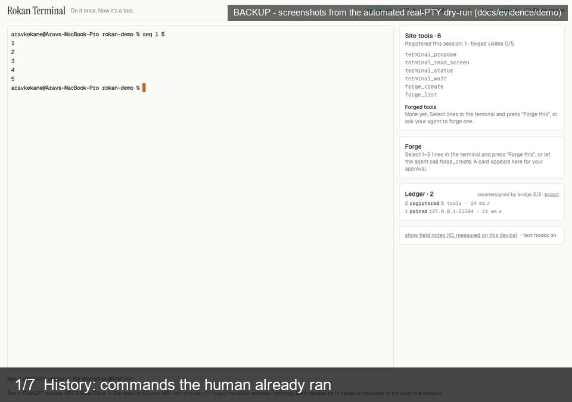

# Rokan Terminal

**Do it once. Now it's a tool.** A web terminal where anything you approve becomes a live WebMCP
tool your agent can call — registered at runtime with `document.modelContext.registerTool()`,
made by you, absent at page load. Nothing a tool does executes: every tool ghost-types, and only
your Enter runs a command. The terminal is the vehicle; the forge is the story.




Entry for the **OpenAI WebMCP Challenge** (Devpost, deadline 2026-09-03 13:00 PT). Apache-2.0.

## For judges — 60 seconds

1. Open the live URL: **`https://rokan-terminal.vercel.app`** in
   **ChatGPT desktop on GPT-5.6 Sol or Terra** (Luna has site tools disabled) or in **Chrome 149+**
   with `chrome://flags/#enable-webmcp-testing` (DevTools → Application → WebMCP shows every
   registration and call).
2. Pair a shell: clone this repo and run `node packages/bridge/bin/rokan-terminal.js` (Node 20+; `npx rokan-terminal` once the package is published) on your own machine and open the link it prints. The **“Try it now — judge sandbox”** button (a throttled 30-minute Linux container, nothing to install) appears on the page as soon as the judge Worker is deployed — it is gated on a Cloudflare Workers Paid plan (status in `docs/PROGRESS.md`).
3. Ask the agent: **“propose `ls`”** → ghost text appears at your prompt → press **Enter**.
4. Select that line → **Forge this** → Approve → the site-tools list gains `forged_<name>` (no
   reload) → ask the agent to call it → your Enter runs it → the ledger shows measured `exit · ms`.

Add `?tour=1` for a three-step guide that verifies each step against real state.

## What is on the page (six fixed tools + up to five forged)

| tool | what it does | never |
| --- | --- | --- |
| `terminal_propose` | ghost-types one command at your prompt | executes |
| `terminal_read_screen` | last N lines, **only if you turned on Share screen**, secrets `[redacted]` | leaks a key |
| `terminal_status` | cwd (if shared), running, last exit code + ms **measured by the shell** | guesses |
| `terminal_wait` | blocks until your Enter/Esc, returns the real exit code and redacted tail | runs anything |
| `forge_create` | opens a card you edit and approve → `forged_<name>` is registered live | registers without you |
| `forge_list` | every forged tool, its content hash, pin state, measured stats | — |
| `forged_<name>` | substitutes params (shell-safe), ghost-types each step; each step needs your Enter | executes |

Same tools, second protocol: `npx rokan-terminal mcp` serves them over MCP stdio to Claude Code,
Cursor or Codex CLI — the page stays the single source of truth; the MCP process can never type.

## Security in one paragraph

WebMCP tool descriptions are hints to a cooperative agent, never a security boundary. **Our
boundary is the keyboard.** Control/bidi characters are rejected so what you see is what would
run; hard-blocked patterns need Enter twice; the screen leaves the tab only when you share it and
only after a single redaction choke point; forged tools carry a content hash (a changed hash needs
a new approval) and one `AbortSignal` each; the ledger is HMAC-chained and countersigned by the
bridge. Full model with tests: [`docs/SECURITY.md`](docs/SECURITY.md).

## Run it yourself

```
pnpm install
pnpm gate                  # typecheck · lint · 94 unit tests · real-PTY bridge smoke · headless WebMCP cases
cd apps/web && pnpm dev    # http://localhost:3000
node packages/bridge/bin/rokan-terminal.js --no-tunnel --app http://localhost:3000   # prints the pairing link
```

Verify a ledger export from the page against your bridge: `node packages/bridge/bin/rokan-terminal.js verify rokan-ledger-<session>.json`.

Headless WebMCP evals (Chrome 152 via the CDP `WebMCP` domain, no consumer needed):
`node evals/run-all.mjs` (prompt line) · `node evals/run-all.mjs --bridge` (real PTY).

## Repo

- `apps/web` — Next.js 15 client: tools, xterm pane with ghost text, forge card, ledger.
- `packages/bridge` — `npx rokan-terminal`: node-pty + WebSocket + Cloudflare quick tunnel + pairing token; `mcp` subcommand.
- `infra/sandbox` — judge mode: Cloudflare Worker + Sandbox container running the same bridge.
- `evals/` — headless harness + 12 cases; `docs/` — `PLAN.md`, `FORGE-PLAN.md`, `TERMINAL-PLAN.md`, `SANDBOX-PLAN.md`, `SECURITY.md`, `FIELD-NOTES.md` (measured consumer behaviour), `PROGRESS.md` (what is green right now).

Every millisecond and call count shown on screen is measured by the code that shows it.
